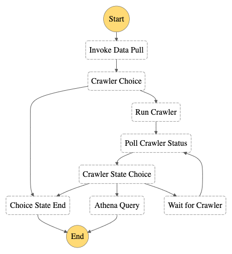

# Project:  Economic Tracking Initiative (projectName)

## Pipeline: REACH JMMI Commodities Data
The REACH JMMI Commodities Data Pipeline draws updates by initiating an HTML scraper on the REACH downloads site to check for new data,
processes the data, and loading the data into a data lake. The pipeline uses Lambdas and orchestrates the service through Step Functions.

The pipeline consists of:
  1. [reach-datascrape.py](https://github.com/abjmorrison/codePortfolio/blob/main/CashProgramsDataCollectionScript/reach-datascrape.py)
      - Scrapes the REACH website for new data
  2. [aws-gluecrawler-trigger.py](https://github.com/abjmorrison/codePortfolio/blob/main/AWSScripts/aws-gluecrawler-trigger.py)
      - Accepts the name of a crawler from StepFunctions and initiates the crawler run.
  3. [aws-gluecrawler-monitor.py](https://github.com/abjmorrison/codePortfolio/blob/main/AWSScripts/aws-gluecrawler-monitor.py)
      - Accepts the name of a glue crawler and gets the status of the crawler run.
  4. [reach-athena-outputquery.py](https://github.com/abjmorrison/codePortfolio/blob/main/CashProgramsDataCollectionScript/reach-athena-outputquery.py)
      - Queries the data catalog using Athena and outputs a .csv of the entire table for use in OOB viz tools
  5. [reach-statemachine.json](https://github.com/abjmorrison/codePortfolio/blob/main/CashProgramsDataCollectionScript/reach-statemachine.json)
      - Pipeline StateMachine

