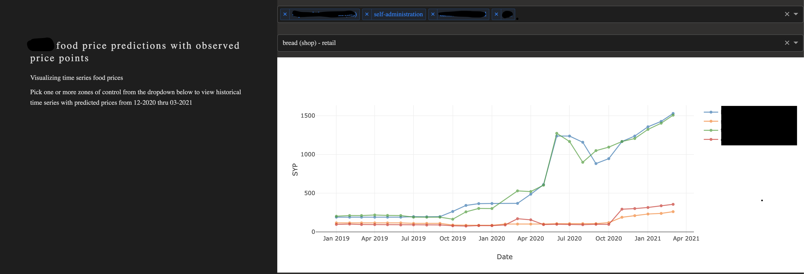

# Project: Simple Plotly Dash Example

This simple proof-of-concept visualization was created using the Plotly Dash library. It uses a multi-choice selector for Zone of Control and a single-choice selector for commodity. The script was containerized using Docker, uploaded to the AWS Elastic Container System, and run via the AWS Fargate service.

